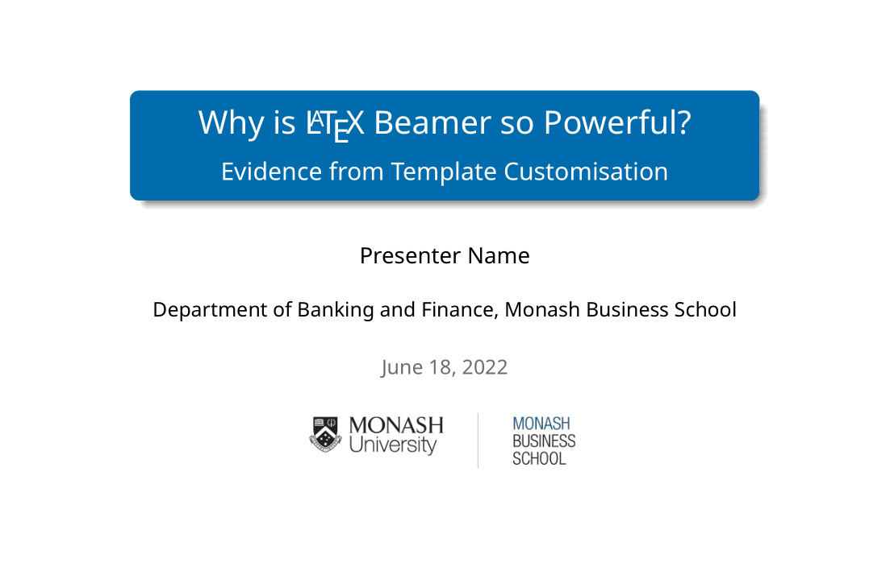
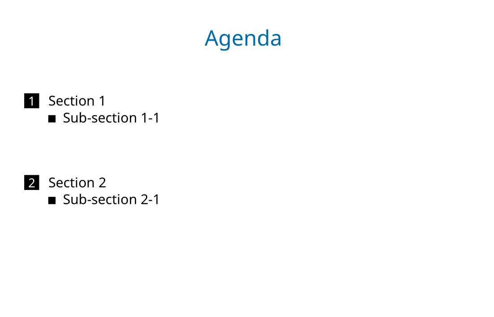
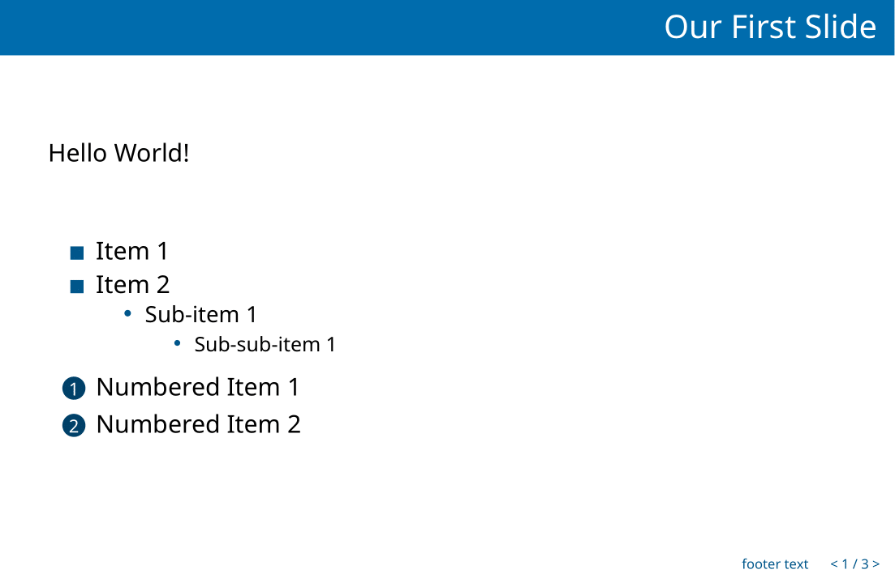
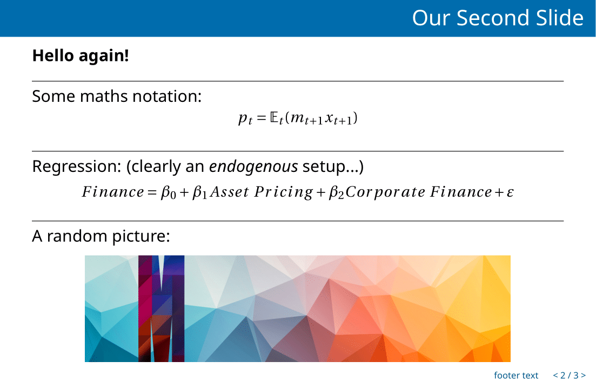
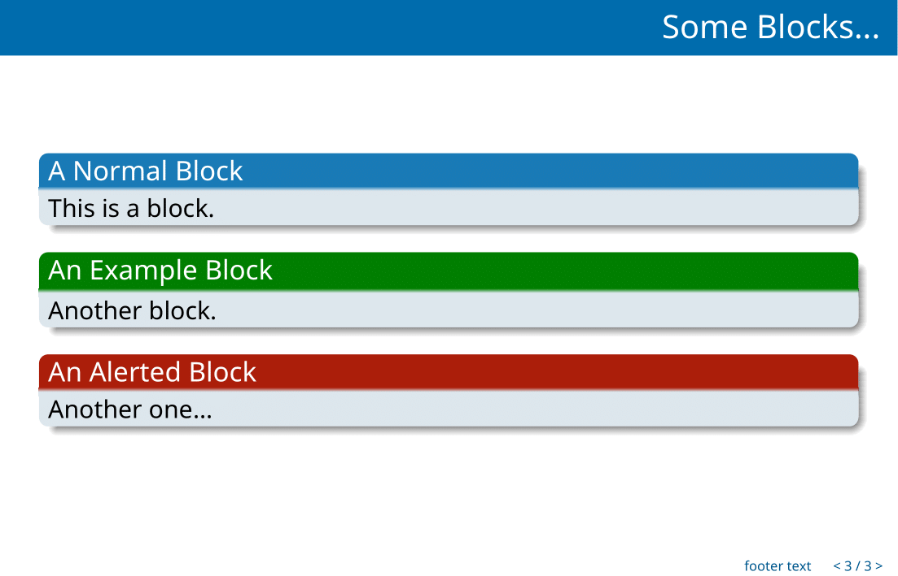

# Custom Monash LaTeX Beamer Theme

This is a self-made unofficial LaTeX Beamer theme for Monash Business School Department of Banking and Finance. 

## Example

Please see the `Example` folder for a minimal working example ([PDF](Example/example.pdf)).

Alternatively, please see the screenshots below:

## Usage

For a one-time use, simply copy all the files & directories in the `MonashBS` into the folder where your `.tex` file is located at.

To conveniently allow for repetitive usage, copy the whole folder `MonashBS` into your `texmf/tex/latex` folder (which should have all the user-installed LaTeX packages). The actual location depends on how you installed LaTeX as well as your operating system, on my Linux machine the path is just `~/texmf/tex/latex` (i.e., in my home directory). If the path does not exist, manually creating those directories will work.

In your `.tex` file, add `\usetheme{monbs}` to the preamble to use the theme. 

## About the Design

- The Colour Theme: The main colour tone is obviously (Monash) Blue, the exact colour code of which is referenced from [here](https://www.monash.edu/__data/assets/pdf_file/0004/1656508/9.-Digital-Guidelines.pdf). 
- The Inner Theme: I use squares as the bullet type for `itemize` items, and circles for subitems. 
- The Outer Theme: This theme has a minimal but elegant outer-theme design - the frame title features Monash blue as the background colour and I made the height of frame title smaller than default to reserve space for the body; the footer only has the short title name in the centre and the frame number on the far right, with Monash blue as the font colour. 
- The Font Theme: The text font theme is helvetica, and the maths font theme is Fourier, both of which in my opinion look nicer than the default.
